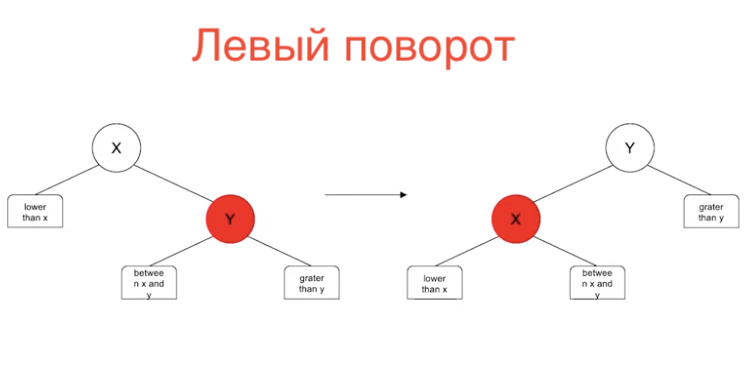

# Домашнее задание

## Цель: Развитие навыков работы со сложными объектами. Практическое применение рекурсии и сортировки, выбора классов для реализации

### Описание домашнего задания:

#### Написать программу, делающую следующее
* Из Предварительно отсортированного списка (List) сформировать двоичное дерево поиска
* Написать рекурсивную функцию поиска в сформированном дереве
* Класс должен имплементировать следующий интерфейс

    public interface SearchTree {
        /**
        @param element to find
        @return element if exists, otherwise - null
        /
        T find(T element);
        List getSortedList();
    }

#### Дополнительная информация

